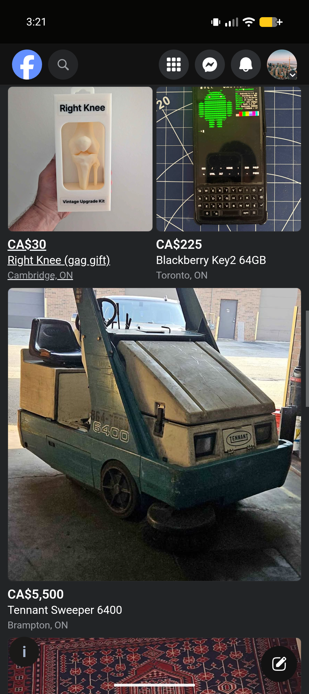
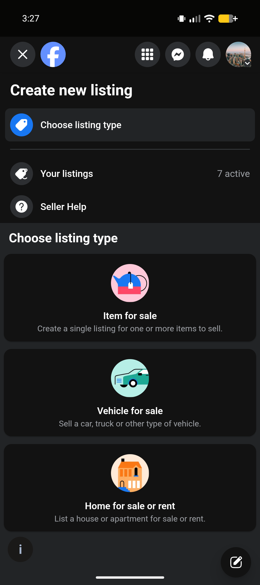
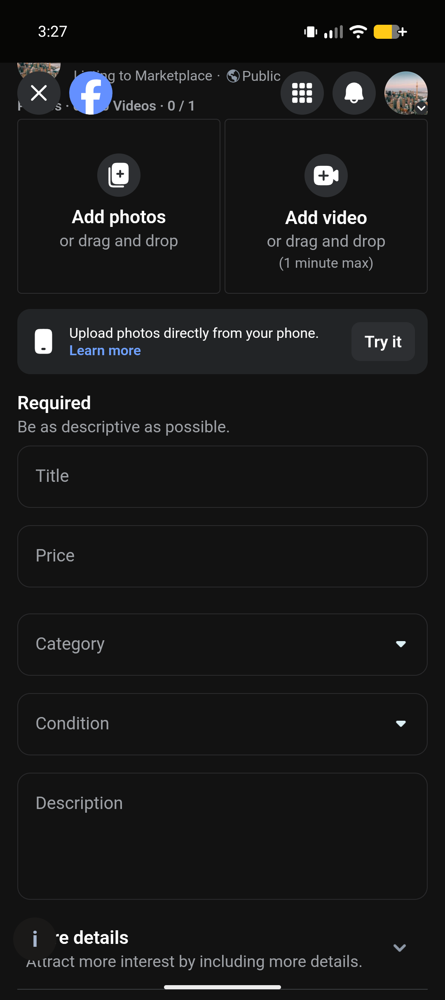
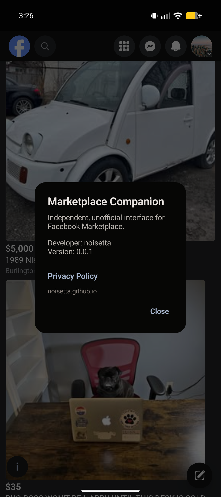

# Marketplace Companion

*A focused Android interface for accessing Facebook Marketplace.*

Current version: **v0.0.1** 
Android: **6.0+**

[Download APK](https://github.com/noisetta/marketplace-companion-releases/releases/download/v0.0.1/Marketplace-Companion-v0.0.1.apk) · [Release notes](https://github.com/noisetta/marketplace-companion-releases/releases/tag/v0.0.1) · [Privacy Policy](https://noisetta.github.io/marketplace-companion/privacy/)

## Screenshots

  
  
  
  

## About

Marketplace Companion provides a focused Android experience for accessing Facebook Marketplace. It is an interface for accessing Marketplace; it does not replace Facebook or provide a separate Marketplace backend.

Marketplace Companion is an independent, unofficial project and is not affiliated with, endorsed by, sponsored by, or operated by Meta Platforms, Inc. or Facebook.

## Features

- Marketplace browsing and search
- Listing viewing
- Create Listing / selling support
- Photo and video selection through Android's system picker
- Marketplace messaging
- Pull-to-refresh
- Native Android Back navigation
- Native About and Privacy controls
- Non-Facebook external links open outside the Facebook WebView/session
- No advertising or analytics SDKs

## Download

Marketplace Companion is distributed through GitHub Releases.

Current release: **v0.0.1**

- [Release](https://github.com/noisetta/marketplace-companion-releases/releases/tag/v0.0.1)
- [Direct APK](https://github.com/noisetta/marketplace-companion-releases/releases/download/v0.0.1/Marketplace-Companion-v0.0.1.apk)
- [SHA-256 checksum](https://github.com/noisetta/marketplace-companion-releases/releases/download/v0.0.1/Marketplace-Companion-v0.0.1.apk.sha256)

## Requirements

- Android 6.0 or later
- Facebook account
- Internet connection

## Installation

1. Download the APK from the [latest GitHub Release](https://github.com/noisetta/marketplace-companion-releases/releases/tag/v0.0.1).
2. Open the APK on your Android device.
3. If prompted, allow installation from the browser or file manager you used to download it.
4. Install Marketplace Companion and sign in to Facebook normally.

Release checksums are provided alongside the APK. Verify the SHA-256 checksum before installing if you want to confirm that the downloaded file matches the published release.

## Privacy

Marketplace Companion includes no advertising or analytics SDKs. Facebook content is displayed through an embedded Android WebView. Full details are available in the [Privacy Policy](https://noisetta.github.io/marketplace-companion/privacy/).

## Support

Marketplace Companion is free to use and independently maintained.

If you find it useful and would like to support continued development:

[Support noisetta on Ko-fi](https://ko-fi.com/noisetta)

Support is entirely optional.

## Developer

Developer: [noisetta](https://github.com/noisetta) 
Website: [noisetta.github.io](https://noisetta.github.io/)
